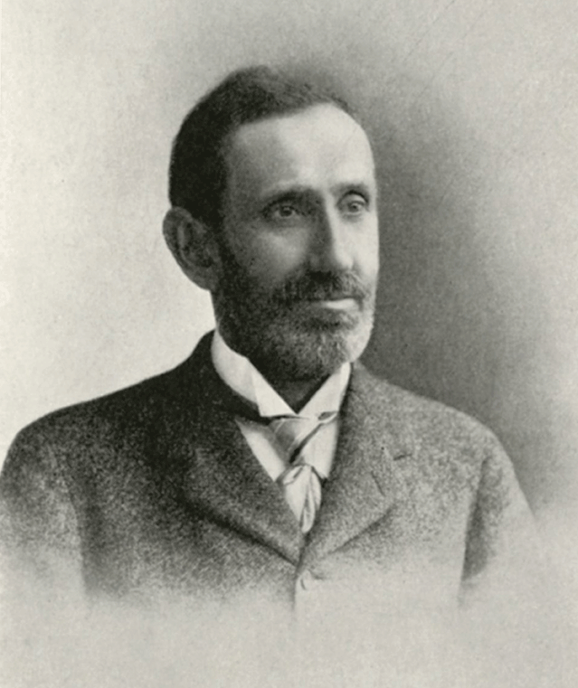
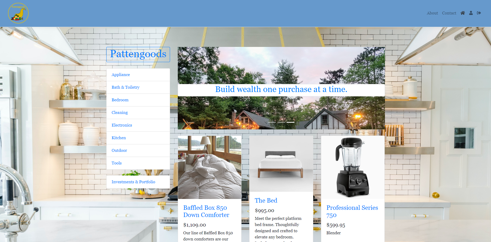

# Pattengoods

  ### By [Taylor Somers](https://github.com/taylorsomers/)

<h3 align ='center'><a href='#requirements'> Requirements </a> • <a href='#setup'> Setup </a> • <a href='#technologies-used'> Technologies </a> • <a href='#contributors'> Contributors </a> • <a href='#protecting-your-data'> Protecting Data </a> • <a href='#cloning'> Cloning </a> • <a href='#app-settings'> AppSettings </a> • <a href='#database-with-migrations'>  Database </a></h3>

## **Description**

  Pattengoods is an application build with C#/.NET using Entity Framework Core on an MVC pattern and connected with a MySQL database that will, at least initially, be seeded with data for the goods on offer through the website. The application functions as a combined storefront and financial technology resource, displaying a searchable set of household goods that may be purchased and recording how often the user purchases each good, on average. Based on the amount the user spends on any given product over time, as well as the risk-adjusted historical average return of a reliable index of dividends-paying stocks, the application calculates how much money the user would have to save and invest in that stock index in order to have a "perpetual supply" of the product, being able to use passive dividend income to cover the cost of the product rather than paying out of regular income. The goal is to provide users access to a selection of high-quality household goods and concretize the advantages of savings and investment, translating the often abstract and theoretical practices of saving and investing into real, necessary material resources. A user who, over time, uses the Pattengoods application to cover regularly purchases goods will gradually free up an increasing amount of disposable income in their budget, experiencing greater material abundance and security.

  ### What is a "Pattengood"?
  
  "Pattengood" is a term I coined while thinking about this project idea. My working definition is as follows:

  Pattengood, n., A composite asset consisting of (1) an item of personal property and (2) a portfolio of dividend-paying stocks the income from which is specifically allocated toward replacing the item when it breaks or wears out.

  Most of us don't realize it, but almost everything we own, insofar as we are committed to replacing it when it is no longer functional, is a financial liability; it represents an outflow of cash over the long term. A pattengood, on the other hand, is something we truly own. Since the item has its own delegated "replacement fund" at work, generating the income necessary to replace it when it has reached the end of its working life, it isn't the drag on our household finances that everyday goods can be. One inspiration for the pattengood is a category of life insurance that has an investment portfolio attached to it, the dividends from which pay the insurance premium so the policy holder doesn't have to pay the premium out of pocket.

  ### Who Was Simon Patten?

  

  The word "pattengood" comes from the relatively (and surprisingly) little-known economist Simon Patten. Though most people probably haven't heard of him, he was one of the most influential economic thinkers of the early 20th Century. Patten was the first professor of economics hired by the Wharton School of Business. He wrote on a multitude of topics, but some of his signature ideas were (1) that just as the health of soil is a function of the diversity of plant species growing in it, the health of an economy is a function of the diversity and interconnectedness of industry operating therein, (2) that in some cases higher prices for goods might themselves generate increased demand for those goods (he coined the phrase "conspicuous consumption" to describe this phenomenon), and (3) that economic development was pushing civilization toward a condition of material abundance wherein people would be defined more by their consumptive than their productive behavior, _i.e._, a "consumer society". His economics of abundance earned him the epithet "the Prophet of Prosperity". Patten's work was and is widely recognized as foundational to the Progressive Era of economic, political, and social reforms, as well as to the New Deal under President Franklin Delano Roosevelt. He remains one of the most intriguing expositors of the possibilities of material abundance, and I thought him a great inspiration for the way of living I'd like to suggest through my application.

## Screenshots

Splash Page

<a href="https://giphy.com/gifs/Nw8UGF5h1kZ043qElv">via GIPHY</a>

 

<a href="https://giphy.com/gifs/Nw8UGF5h1kZ043qElv">via GIPHY</a>

Product details & purchase

 

<a href="https://media.giphy.com/media/jrTY64SDxdaqKydMI0/giphy.gif">via GIPHY</a>

User profile & portfolio

## Languages & Technologies Used:

  ### Programming Languages, Libraries, & Frameworks
  * [ASP.NET MVC](https://dotnet.microsoft.com/apps/aspnet/mvc)
  * [Bootstrap](https://getbootstrap.com/)
  * [CSS](https://en.wikipedia.org/wiki/Cascading_Style_Sheets)
  * [C#](https://docs.microsoft.com/en-us/dotnet/csharp/)
  * [Entity Framework Core](https://docs.microsoft.com/en-us/ef/core/)
  * [HTML](https://developer.mozilla.org/en-US/docs/Web/HTML)
  * [MySQL](https://www.mysql.com/)
  * [.NET Core](https://dotnet.microsoft.com/download/dotnet-core/2.2)

  ### Operating Systems & Programs
  * [Brave](https://brave.com/)
  * [Microsoft PowerShell](https://docs.microsoft.com/en-us/powershell/)
  * [Microsoft Windows 10](https://www.microsoft.com/en-us/windows/get-windows-10)
  * [MySql Workbench](https://www.mysql.com/products/workbench/)
  * [Visual Studio Code](https://code.visualstudio.com/)

  

## **REQUIREMENTS**

* _[Git v2.62.2 or Later](https://git-scm.com/downloads/)_, _[Microsoft PowerShell](https://docs.microsoft.com/en-us/powershell/)_, or other command-line shell or terminal.
* _[MySQL Workbench](https://www.mysql.com/products/workbench/)_
* _[.Net Core v2.2](https://dotnet.microsoft.com/download/dotnet-core/2.2)_

## **SETUP**

### **CLONING**

* Copy the repo link as shown in the image below.

* Paste the link in the field provided by VsCode as thown in the image below.

* You will be prompted to open the directory once you have cloned it. Select 'open'.

### **INSTALLING WITH DOTNET**

With the root project folder open in your code editor, execute the following in your terminal:

``cd ProjectName``

``dotnet restore``

``dotnet build``

``dotnet watch run``

### **APP SETTINGS**

**You need to update your username and password in the appsettings.json file.**

_By default these are set to user:root and an empty password. If you are unsure, refer to the settings for your MySqlWorkbench._

### **PROTECTING YOUR DATA**

* Step 1: Create a .gitignore file in the top level of your project directory. populate the file as shown in step 1 of the image below.

* Step 2: Commit that .gitignore file (this prevents your sensitive information like your API key being shown to others). **DO NOT PROCEED UNTIL YOU DO THIS!**

### **DATABASE WITH MIGRATIONS**

With the root project folder open in your code editor, execute the following in your terminal:

``cd ProjectName``

``dotnet restore``

``dotnet build``

``dotnet ef database update``

## Known Bugs

  None at this time.

## Support & Contact Details

  * You are welcome to contact the [author](https://github.com/taylorsomers/) via GitHub with any concerns, feedback, possible contributions, questions, or suggestions.

## **Contributors**

| [ <b>Taylor Somers</b>](https://www.linkedin.com/in/taylorsomers/) 

## Attributions & Credits

### Logo
* [Milenioscuro](https://commons.wikimedia.org/wiki/User:Milenioscuro)
* [SajoR](https://commons.wikimedia.org/wiki/User:SajoR)

### Photography
* [Chastity Cortijo](https://unsplash.com/@chastityco)
* [Shaun Montero](https://unsplash.com/@notsazuki)
* [NeONBRAND](https://unsplash.com/@neonbrand)
* [Annie Spratt](https://unsplash.com/@anniespratt)
* [Alex Suprun](https://unsplash.com/@sooprun)

### README Formatter
* [MakeMeTakeMeReadMe](https://github.com/tmemmerson/MakeMeTakeMeReadMe.Solution) by [Tristan Emmerson](https://www.linkedin.com/in/tristan-emmerson/)

## License

  * This program is free to use under the [GNU Affero General Public License AGPLv3.0](https://www.gnu.org/licenses/agpl-3.0.html).  © 2020 Taylor Somers. All rights reserved.
  * Cornucopia logo is licensed under under the [Creative Commons Attribution 3.0 Unported (CC BY 3.0)](https://creativecommons.org/licenses/by/3.0/deed.en) license.